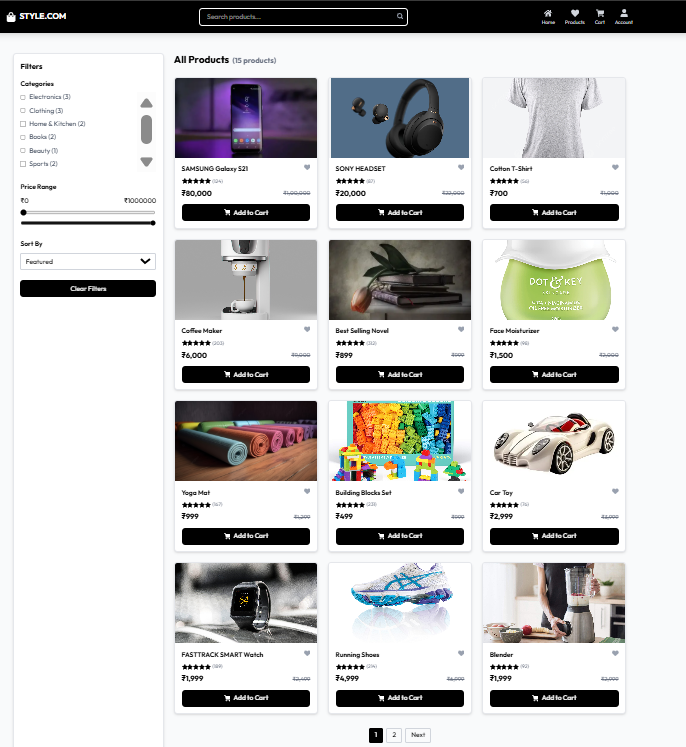
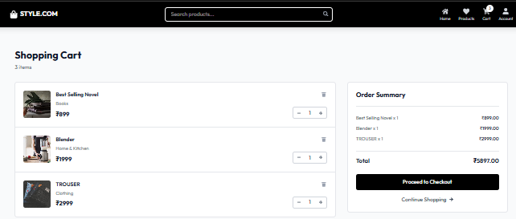
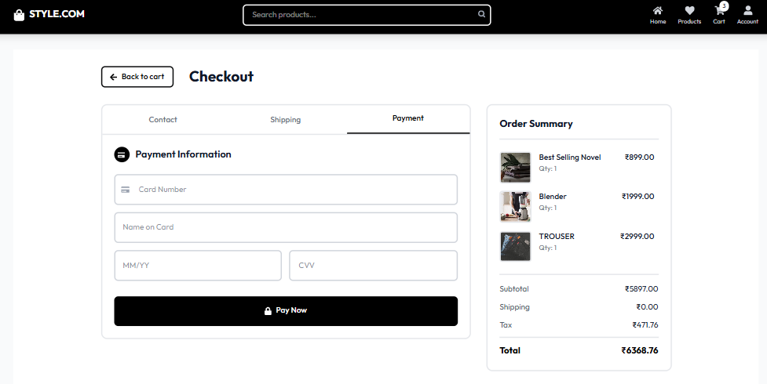

# 🛍️ E-Commerce Frontend

A modern, responsive **E-Commerce Frontend** built with **React** and **Vite** that delivers a seamless online shopping experience. The application allows users to browse products, filter by category, search products, manage their shopping cart, and complete the checkout process with an intuitive and responsive user interface.

---

# 📸 Application Screenshots

## 🏠 Home Page

<p align="center">
  
</p>

---

## 🛍️ Products Page

<p align="center">
  
</p>

---

## 🛒 Shopping Cart

<p align="center">
  
</p>

---

## 💳 Checkout Page

<p align="center">
  
</p>

---

# ✨ Features

- 🏠 Responsive Home Page
- 🛍️ Product Listing
- 🔍 Product Search
- 🏷️ Category Filtering
- 📄 Product Details Page
- 🛒 Shopping Cart
- ➕ Add Products to Cart
- ➖ Increase/Decrease Quantity
- 🗑️ Remove Products from Cart
- 💳 Checkout Page
- 🔔 Toast Notifications
- 💾 Local Storage Cart Persistence
- 📱 Mobile Friendly UI
- ⚡ Fast Performance with Vite

---

# 🛠️ Tech Stack

## Frontend

- React 19
- Vite 7
- React Router DOM
- Tailwind CSS
- React Icons
- Formik
- Yup
- React Toastify
- TanStack React Query

---

# 📂 Project Structure

```text
E_Commerce_Website/
│
├── docs/
│   └── screenshots/
│       ├── home.png
│       ├── products.png
│       ├── cart.png
│       └── checkout.png
│
├── public/
│
├── src/
│   ├── assets/
│   ├── components/
│   ├── pages/
│   ├── data/
│   ├── utils/
│   ├── App.jsx
│   ├── main.jsx
│   └── index.css
│
├── package.json
├── package-lock.json
├── vite.config.js
├── eslint.config.js
├── .gitignore
└── README.md
```

---

# 🚀 Getting Started

## Prerequisites

Before running the project, make sure you have:

- Node.js (v18 or above)
- npm

Verify installation:

```bash
node -v
npm -v
```

---

# 📥 Installation

Clone the repository

```bash
git clone https://github.com/SuprithKumarBL20/E_Commerce_Website.git
```

Navigate into the project

```bash
cd E_Commerce_Website
```

Install dependencies

```bash
npm install
```

---

# ▶️ Run the Development Server

Start the development server:

```bash
npm run dev
```

Open your browser and visit:

```
http://localhost:5173
```

---

# 📦 Build for Production

Generate an optimized production build:

```bash
npm run build
```

---

# 🧹 Lint the Project

Run ESLint:

```bash
npm run lint
```

---

# 📄 Application Pages

- 🏠 Home
- 🛍️ Products
- 📄 Product Details
- 🛒 Shopping Cart
- 💳 Checkout

---

# 📚 Key Functionalities

- Browse all available products
- Search products instantly
- Filter products by category
- View detailed product information
- Add products to the shopping cart
- Update product quantity
- Remove products from the cart
- Persistent shopping cart using Local Storage
- Checkout page with order summary
- Toast notifications for user actions
- Responsive layout for desktop, tablet, and mobile devices

---

# 📦 Project Dependencies

### Frontend Libraries

- React
- React Router DOM
- Tailwind CSS
- React Icons
- Formik
- Yup
- React Toastify
- TanStack React Query

---

# 🔮 Future Enhancements

- 🔐 User Authentication
- ❤️ Wishlist
- 💳 Online Payment Gateway Integration
- 📦 Order History
- ⭐ Product Reviews & Ratings
- 🛠️ Admin Dashboard
- 🌐 Backend API Integration
- 📊 Inventory Management
- 🔍 Advanced Product Filters

---

# 👨‍💻 Author

**Suprith Kumar B L**

- GitHub: https://github.com/SuprithKumarBL20

---

# 🤝 Contributing

Contributions are welcome.

1. Fork the repository.
2. Create a new feature branch.

```bash
git checkout -b feature-name
```

3. Commit your changes.

```bash
git commit -m "Add new feature"
```

4. Push the branch.

```bash
git push origin feature-name
```

5. Open a Pull Request.

---

# 📜 License

This project is intended for learning and portfolio purposes.

---

# ⭐ Support

If you found this project useful, consider giving it a ⭐ on GitHub.
